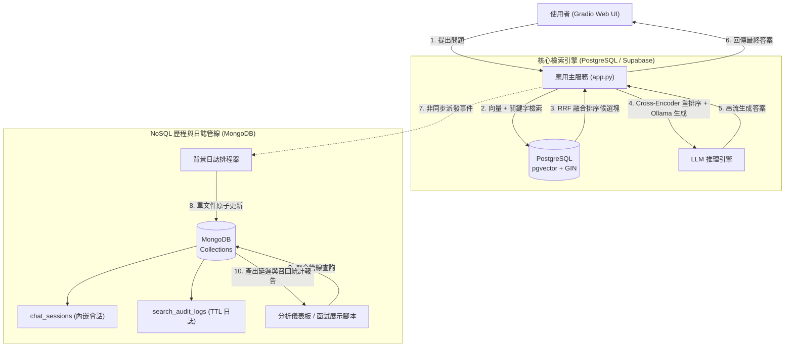

# 技術手冊 RAG 系統之 NoSQL (MongoDB) 雙資料庫架構整合與求職實戰計畫書

本文件定義 `scanPdf` 專案中引入 NoSQL（MongoDB）的整合架構與實作計畫。本計畫採取「雙資料庫職責分離（Polyglot Persistence）」架構，保留 PostgreSQL 於向量檢索（pgvector）與全文檢索的高效混合運算能力，同時引入 MongoDB 負責非結構化日誌、對話會話歷程（Chat Sessions）與聚合分析（Analytics），以在求職面試中精準展示 NoSQL 文件建模、分散式索引與聚合管線（Aggregation Pipeline）的核心實戰能力。

---

## 一、 問題背景與設計目標

### 1. 現況分析與求職需求落差
* **現行單一關聯式架構**：目前專案所有資料（切塊內容、向量、全文檢索索引）全數儲存於 PostgreSQL / Supabase。此架構在 RAG 核心檢索表現優異，但缺乏展示 NoSQL 技術棧的場景。
* **面試核心考點**：企業在考核 NoSQL / MongoDB 時，重點不在於能否將關聯表轉存為 JSON，而在於：
  1. **文件建模策略（Data Modeling）**：內嵌（Embedding）與引用（Referencing）的決策權衡。
  2. **高內聚單文件原子性（Document-Level Atomicity）**：利用 `$push`、`$inc` 等原子操作實現無鎖高併發寫入。
  3. **聚合管線運算（Aggregation Pipeline）**：多階段資料轉換（`$match`、`$unwind`、`$group`、`$sort`）。
  4. **索引最佳化與效能調優**：複合索引最左前綴原則（ESR Rule: Equality, Sort, Range）與 TTL 索引維護。

### 2. 核心設計原則
1. **多模型持久化架構（Polyglot Persistence）**：嚴禁將已最佳化的 pgvector 向量運算強行搬遷至 MongoDB 免費雲端叢集（避免 512 MB 限制與 RRF 融合效能降級），而是各取所長。
2. **零阻斷無感整合（Non-blocking Auditing）**：對話記錄與使用者回饋寫入採非同步或背景線程執行，不增加既有 Gradio RAG 查詢的回應延遲。
3. **嚴謹資料結構治理（Schema Governance）**：使用 Pydantic 進行資料模型定義，克服 NoSQL 動態綱要易產生髒資料的弊端。
4. **完整本機與雲端雙模支援**：支援本地端 Docker 與 MongoDB Atlas 雲端實體切換，便於自動化測試。

---

## 二、 雙資料庫職責分工與架構漏洞防禦矩陣

### 1. 資料庫職責劃分矩陣

| 資料維度 | 負責資料庫 | 選型技術考量 | 儲存結構特徵 |
| :--- | :--- | :--- | :--- |
| **手冊向量與切塊** | **PostgreSQL** (Supabase) | 支援 HNSW 向量索引與 GIN 全文檢索，可由單一 CTE 完成 RRF 混合排序。 | 具備嚴格 Schema 之關聯表 (`manual_chunks`)。 |
| **對話會話歷程** | **MongoDB** | 支援巢狀問答輪次（內嵌陣列），單次查詢即取回完整對話歷史。 | 內嵌式文件 (`chat_sessions`)。 |
| **檢索追蹤日誌** | **MongoDB** | 寫多讀少，欄位隨不同模型評估指標動態增減，支援自動過期清理。 | 時序特化文件 (`search_audit_logs`)，配置 TTL 索引。 |
| **效能指標聚合** | **MongoDB** | 透過原生聚合管線直接運算 P95 延遲、使用者滿意度與高頻搜尋關鍵字。 | Aggregation 記憶體串流運算。 |

### 2. 四大架構漏洞與防禦機制

| 潛在架構漏洞 | 發生情境 | 系統危害 | 本計畫標準防禦機制 |
| :--- | :--- | :--- | :--- |
| **1. 單文件容量超限<br>(16 MB BSON Limit)** | 使用者對話輪次持續增加，無限制將歷史訊息 `$push` 進單一文件。 | 觸發 MongoDB 16 MB 單文件大小上限，寫入崩潰。 | **滑動視窗封頂機制**：<br>使用 `$slice: -50` 限制單一會話最多內嵌 50 輪問答，歷史超額資料封存。 |
| **2. 鎖競爭與延遲擴散<br>(Latency Spillover)** | Gradio 生成回答時同步等待 MongoDB 寫入確認（`w: "majority"`）。 | 若資料庫網路延遲增加，直接拖慢使用者介面回應速度。 | **異步隊列解耦**：<br>透過獨立背景執行緒（Background Worker）進行日誌寫入，失敗不阻斷主查詢。 |
| **3. 索引失效全表掃描<br>(Collection Scan)** | 統計分析查詢未依據索引順序，或在未建立索引的動態欄位排序。 | 造成資料庫 CPU 飆高，記憶體工作集（Working Set）被清空。 | **遵循 ESR 複合索引規範**：<br>精確匹配欄位置前，排序欄位居中，範圍篩選置後。 |
| **4. 髒資料氾濫<br>(Schema Drift)** | 因動態綱要特性，不同版本程式碼寫入不同型別的除錯資訊。 | 聚合管線執行 `$avg` 或 `$group` 時發生型別轉換例外。 | **Pydantic 模型驗證層**：<br>進入 MongoDB 驅動程式前強制作型別檢查與資料清洗。 |

---

## 三、 系統架構與資料流圖



---

## 四、 資料模型設計（Data Modeling）

### 1. 會話集合（`chat_sessions`）
展現「內嵌模型（Embedding）」設計優勢，將多輪對話內嵌於單一會話文件中：

```json
{
  "_id": "ObjectId('...')",
  "session_id": "sess_20260929_abcd1234",
  "user_id": "user_demo",
  "created_at": "2026-09-29T09:00:00Z",
  "updated_at": "2026-09-29T09:05:00Z",
  "turn_count": 2,
  "turns": [
    {
      "turn_id": 1,
      "query": "機件保養週期與規格為何？",
      "retrieved_chunk_ids": ["manual_A_12", "manual_A_15"],
      "response": "根據第三章規定，每 500 小時需進行更換...",
      "latency_ms": 342.5,
      "feedback": {"rating": 1, "comment": "回答精確"},
      "timestamp": "2026-09-29T09:00:02Z"
    }
  ]
}
```

* **索引設計**：
  * 複合索引：`{"user_id": 1, "updated_at": -1}`（支援特定使用者依時間排序取得歷史紀錄）。
  * 唯一索引：`{"session_id": 1}`。

### 2. 檢索稽核日誌集合（`search_audit_logs`）
展現「時序日誌」與「TTL 自動清理」設計：

```json
{
  "_id": "ObjectId('...')",
  "timestamp": "2026-09-29T09:00:01Z",
  "session_id": "sess_20260929_abcd1234",
  "query": "機件保養週期與規格為何？",
  "query_type": "hybrid",
  "chunk_type_filter": "table",
  "vector_latency_ms": 45.2,
  "keyword_latency_ms": 12.8,
  "rerank_latency_ms": 120.4,
  "total_latency_ms": 178.4,
  "result_count": 5,
  "top_scores": [0.032, 0.028, 0.015]
}
```

* **索引設計**：
  * TTL 索引：`{"timestamp": 1}`，設定 `expireAfterSeconds: 2592000`（30 天自動物理刪除，展示自動化運維能力）。
  * 效能分析索引：`{"query_type": 1, "timestamp": -1}`。

---

## 五、 實作模組規劃與檔案職責

專案內新增獨立 `nosql/` 模組，避免污染既有檢索核心程式碼：

```text
scanPdf/
├── chunkingRAG/                # [保持不變] PostgreSQL + Supabase 檢索核心
│   ├── db_config.py
│   ├── search_manual.py
│   └── pipeline_postgres.py
├── nosql/                      # [新增] MongoDB 專案模組
│   ├── __init__.py
│   ├── mongo_client.py         # 連線池初始化與索引自動配置（單例模式）
│   ├── models.py               # Pydantic 資料綱要驗證定義
│   ├── session_logger.py       # 非同步對話寫入與滑動視窗維護
│   └── analytics_pipeline.py   # 聚合管線分析（面試高頻示範模組）
├── scripts/
│   └── demo_mongodb_interview.py # [新增] 面試現場演示與效能分析腳本
├── pyproject.toml              # 新增 pymongo 依賴
└── app.py                      # 在 Gradio 介面串接非同步日誌
```

---

## 六、 具體執行步驟與技術排程

### 步驟 1：依賴套件與連線設定（Python 3.12 規範）
1. 透過 `uv` 新增驅動程式依賴：
   ```bash
   uv add pymongo
   ```
2. 於 `.env.example` 與 `.env` 補強連線配置（支援本地與 Atlas）：
   ```text
   MONGODB_URI=mongodb://localhost:27017
   MONGODB_DB_NAME=scanpdf_analytics
   ```

### 步驟 2：實作連線管理與索引自癒（`nosql/mongo_client.py`）
1. 使用單例模式（Singleton）管理 `MongoClient`，配置適配連線池大小（`maxPoolSize=50`, `minPoolSize=5`）。
2. 在服務啟動階段自動校驗並建立索引（複合索引、TTL 索引、唯一鍵），防止冷啟動缺乏索引導致查詢退化。

### 步驟 3：資料模型驗證（`nosql/models.py`）
1. 宣告 `ChatTurnModel`、`SessionModel` 與 `AuditLogModel`。
2. 針對欄位型別嚴格校驗，確保時間欄位統一採用 UTC 時區。

### 步驟 4：非同步日誌與會話寫入（`nosql/session_logger.py`）
1. 封裝 `record_turn()` 方法，利用 MongoDB 的 `$push` 搭配 `$slice: -50` 實現單文件內嵌滑動視窗。
2. 利用 Python `concurrent.futures.ThreadPoolExecutor` 進行背景寫入，確保主線程 Gradio 零等待。

### 步驟 5：實作高階聚合管線分析（`nosql/analytics_pipeline.py`）
實作三大面試展示等級的聚合查詢：
1. **P95 / P99 檢索延遲統計**：利用 `$facet`、`$bucket` 或是 `$percentile` 演算法。
2. **高頻搜尋意圖與回饋分析**：利用 `$unwind` 拆解陣列後執行加權平均評分。
3. **模型召回命中率統計**：依據 `chunk_type` 統計向量路徑與關鍵字路徑的比例分佈。

### 步驟 6：整合 Gradio 使用者介面（`app.py`）
1. 在使用者完成問答後，於背景發送寫入事件。
2. 在 Gradio 管理頁籤中新增「NoSQL 檢索日誌與運維分析」視圖，直接展示聚合管線產出之統計數據。

---

## 七、 驗收測試規範（Verification Checklist）

| 驗收項目 | 驗收方式與標準指令 | 預期成果 |
| :--- | :--- | :--- |
| **連線與索引驗收** | 執行 `uv run python -m nosql.mongo_client` | 終端成功連線並列印出所有現存索引名單，包含 TTL 索引。 |
| **資料寫入冪等與原子性** | 執行單元測試連發 10 次相同 `session_id` 的問答寫入 | `turn_count` 精確等於 10，文件無死鎖，`turns` 陣列順序正確。 |
| **滑動視窗上限保護** | 寫入超過 60 筆對話紀錄 | 文件大小未超標，`turns` 陣列長度嚴格維持在 50 筆。 |
| **聚合管線分析正確性** | 執行 `uv run python nosql/analytics_pipeline.py` | 終端順利輸出平均延遲、分位數與使用評分報表，無語法例外。 |
| **系統延遲無損驗收** | 使用 Gradio 連續提問 5 次 | RAG 串流輸出速度未受影響，MongoDB 背景連線無阻塞。 |

---

## 八、 面試核心提問防禦指南（Interview Readiness）

當面試官針對此專案詢問 NoSQL 架構時，依據以下論點回答：

1. **問：為什麼不把整個 RAG 系統全搬到 MongoDB？**
   * **答**：這是考量「技術適配性（Right tool for the right job）」與「系統吞吐量」。PostgreSQL 的 pgvector 允許在資料庫內部原生透過單一 SQL 執行向量與關鍵字的多路召回及 RRF 排名融合；若改至 MongoDB，混合檢索與二次排序需拉回應用層運算，增加了網路 I/O 與記憶體負擔。因此我採取多模型持久化架構，讓 PostgreSQL 專注密集型向量運算，MongoDB 專注動態資料日誌與聚合分析。
2. **問：在 MongoDB 中，對話歷史你選擇內嵌（Embedding）還是引用（Referencing）？為什麼？**
   * **答**：我選擇內嵌模式。因為在對話系統中，查詢需求幾乎都是「依據 session_id 取出當前會話的全部歷史」，內嵌模式能利用局部性原理（Data Locality）單次 I/O 讀取完畢，避免像 SQL 那樣頻繁進行跨表 JOIN。為防止文件突破 16 MB 限制，我透過 `$push` 搭配 `$slice: -50` 限制最多保留 50 輪，兼顧效能與容量安全。
3. **問：你是如何分析系統查詢效能的？**
   * **答**：我設計了完整的 MongoDB Aggregation Pipeline。利用 `$unwind` 展開多輪查詢指標，搭配 `$group` 統計各類檢索模式（純向量、全文、混合）的平均耗時與 P95 延遲，做為 RAG 系統參數微調（例如 fetch_k 大小）的量化依據。
