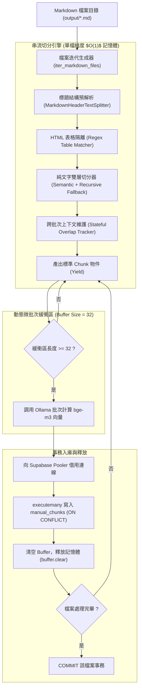

# 技術手冊 RAG 串流切分與 PostgreSQL 增量入庫實作計畫書 (Stream Version Ingestion)

本文件定義 `chunkingRAG/` 模組中超大規模技術手冊之串流資料處理管線（Streaming ETL Pipeline）。針對上萬頁 PDF 產出之巨量 Markdown 檔案，以常數級記憶體（$O(1)$ Memory）完成語意切分、向量化與 PostgreSQL (Supabase) 增量寫入，徹底杜絕記憶體溢出（OOM）與長連線中斷風險。

---

## 一、 問題背景與設計目標

### 1. 現行架構瓶頸分析（In-Memory Pipeline）
* **記憶體累積隱患**：現行 [pipeline_postgres.py](file:///Users/rickyho/Documents/github/scanPdf/chunkingRAG/pipeline_postgres.py) 先行遍歷所有 Markdown 檔案，將所有純文字與表格區塊全數放入記憶體變數 `records_to_insert`。若檔案規模擴大至數千頁（產生數十萬個區塊），Python 程序之 Heap Memory 將急遽膨脹。
* **連線持有風險**：若改為邊切邊放但未妥善管理連線生命週期，長時間佔用 Supabase Session Pooler (連接埠 5432) 易遭防火牆重置或連線逾時（Connection Reset）。

### 2. 串流版本核心設計目標
1. **常數記憶體佔用（$O(1)$ Memory Footprint）**：採用 Python 生成器（Generator），記憶體內部僅常駐單一檔案與當前批次（預設 32 筆）之資料，記憶體使用量與檔案總數量完全脫鉤。
2. **上下文重疊狀態保持（Stateful Overlap Tracking）**：在串流切分與緩衝區清空（Flush）交界處，精準保存跨批次尾句，確保 `extract_overlap_prefix` 邏輯不中斷。
3. **檔案級事務原子性（Per-File Transaction Atomicity）**：以單一 Markdown 檔案為事務邊界（Transaction Boundary）。單檔成功則 Commit，異常則 Rollback，避免資料庫留存半殘資料。
4. **防禦性冪等與斷點續傳（Idempotency & Resumability）**：確定性唯一鍵 `chunk_id` 搭配 `ON CONFLICT DO UPDATE`，中斷後可直接重跑而不產生重複資料。
5. **模組復用性（DRY 原則）**：完全復用現有 [db_config.py](file:///Users/rickyho/Documents/github/scanPdf/chunkingRAG/db_config.py)，不另開重複資料夾。

---

## 二、 四大架構漏洞與防禦機制矩陣

| 潛在架構漏洞 | 發生情境 | 系統危害 | 串流版本標準防禦機制 |
| :--- | :--- | :--- | :--- |
| **1. 上下文斷裂<br>(Overlap Loss)** | 當緩衝區滿 32 筆執行清空時，上一個 Chunk 的結尾文字一併被拋棄。 | 跨批次的第一個 Chunk 無法向前引用前文，語意代名詞斷裂。 | **狀態保留器（Stateful Tracker）**：<br>獨立宣告 `last_chunk_text` 狀態變數，跨批次持續傳遞，不受 Buffer 清空影響。 |
| **2. 事務非原子性<br>(Dirty Data)** | 切分處理到第 50 頁途中發生網路異常或伺服器中斷。 | 資料庫留存殘留資料；重啟時產生垃圾或狀態錯亂。 | **檔案級事務（Per-File Transaction）**：<br>單一檔案內部執行獨立事務控制；非致命錯誤自動 Rollback 當前檔案。 |
| **3. 長連線逾時<br>(Connection Flap)** | 全程開啟資料庫連線達 30 分鐘，中途切分計算耗時。 | 觸發 Supabase Pooler 閒置斷線或吃滿 Session 限制。 | **延遲批次連線（Lazy Flush）**：<br>切分計算時不佔用連線，緩衝區滿額才借出連線，寫入完成立即提交。 |
| **4. 顯存溢出<br>(VRAM Spike)** | 單一無標題段落極長（> 50,000 字元），整段送入 `SemanticChunker`。 | 模型計算相鄰句向量矩陣時超出 Context Window 崩潰。 | **標題預分割 + Recursive 硬兜底**：<br>強迫先經 Markdown 標題切分，超過 1000 字元硬性二次兜底。 |

---

## 三、 系統架構與資料流圖



---

## 四、 模組規劃與檔案職責

在現有 `chunkingRAG/` 目錄內新增獨立串流腳本，保持設定與檢索架構一致：

```text
chunkingRAG/
├── db_config.py            # [共用] Supabase 連線與 Ollama 設定
├── reranker.py             # [共用] Cross-Encoder 重排序模型
├── search_manual.py        # [共用] 雙路混合檢索與 RRF 融合
├── pipeline_postgres.py    # [既有] 記憶體全量集中切分入庫管線
└── pipeline_stream.py      # [新增] 串流式防 OOM 增量入庫管線
```

---

## 五、 核心程式碼實作規範

### 1. 跨批次上下文生成器（Generator with State）

```python
def stream_chunks_from_section(
    sec_text: str,
    last_chunk_text: str,
    target_overlap_chars: int = 250,
    max_safe_length: int = 1000,
    chunker_type: str = "semantic"
):
    """
    純文字串流切分生成器：
    維持跨區塊之 last_chunk_text，確保緩衝區 Flush 後仍保有前文記憶。
    """
    if not sec_text.strip():
        return, last_chunk_text

    # 執行切分（語意或遞迴）
    if chunker_type == "semantic":
        raw_chunks = semantic_splitter.split_text(sec_text)
        normalized = []
        for c in raw_chunks:
            if len(c) > max_safe_length:
                normalized.extend(safety_fallback_splitter.split_text(c))
            else:
                normalized.append(c)
    else:
        normalized = safety_fallback_splitter.split_text(sec_text)

    for chunk in normalized:
        # 提取前一區塊完整句子作為前綴
        prefix = extract_overlap_prefix(last_chunk_text, target_overlap_chars)
        final_chunk = f"{prefix}\n{chunk}" if prefix else chunk
        last_chunk_text = chunk
        yield final_chunk, last_chunk_text
```

### 2. 檔案級事務與批次 Flush 寫入

```python
def flush_batch(conn, batch_records, embeddings_model):
    """批次計算向量並執行冪等寫入，寫入完畢立即釋放記憶體"""
    if not batch_records:
        return

    contents = [clean_for_embedding(r["content"]) for r in batch_records]
    vectors = embeddings_model.embed_documents(contents)

    with conn.cursor() as cur:
        cur.executemany("""
            INSERT INTO manual_chunks (
                chunk_id, source_file, chunk_type, chunk_index,
                h1, h2, h3, h4, h5, content, embedding
            ) VALUES (
                %(chunk_id)s, %(source_file)s, %(chunk_type)s, %(chunk_index)s,
                %(h1)s, %(h2)s, %(h3)s, %(h4)s, %(h5)s, %(content)s, %(embedding)s
            )
            ON CONFLICT (chunk_id) DO UPDATE SET
                content = EXCLUDED.content,
                embedding = EXCLUDED.embedding,
                h1 = EXCLUDED.h1,
                h2 = EXCLUDED.h2,
                h3 = EXCLUDED.h3,
                h4 = EXCLUDED.h4,
                h5 = EXCLUDED.h5;
        """, [
            {**rec, "embedding": vec}
            for rec, vec in zip(batch_records, vectors)
        ])
```

---

## 六、 驗證與壓力測試方案

### 1. 斷點續傳與冪等性驗證
* **測試方式**：執行串流腳本，處理至第 20 份檔案時強制發送 `SIGINT` (Ctrl+C) 中斷。
* **驗收指標**：
  * 資料庫中前 19 份檔案完整入庫且中繼資料齊全。
  * 重新執行相同指令，系統自動更新或略過既有資料，不引發 `UniqueViolation` 錯誤，最終總數維持 406 筆。

### 2. 記憶體開銷基準測試（RAM Benchmark）
* **測試方式**：使用 Python `tracemalloc` 監控執行期間之 Peak Memory。
* **驗收標準**：
  * 現行全量版本：記憶體峰值隨文件總量線性成長。
  * 串流版本：不論處理 63 份檔案或 10,000 份檔案，記憶體峰值嚴格限制在 **150 MB 以下**（主要為 Embedding 模型通信緩衝）。

---

## 七、 執行指令規範

本專案統一使用 `uv` 於 Python 3.12 環境下執行：

```bash
# 預設執行串流切分入庫（語意切分模式）
uv run python chunkingRAG/pipeline_stream.py --batch-size 32 --chunker semantic

# 高速字元切分串流入庫（大檔案快速驗證）
uv run python chunkingRAG/pipeline_stream.py --batch-size 64 --chunker recursive
```
